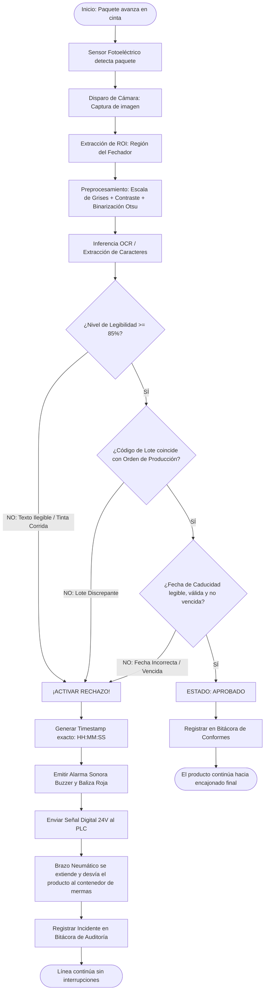

# INFORME TÉCNICO Y RESOLUCIÓN DE CASO DE ESTUDIO
## CASO 1: Control de Calidad y Trazabilidad en la Línea de Empaque
**Empresa de Estudio:** Embutidos Kimby  
**Enfoque Tecnológico:** OCR (Optical Character Recognition), ICR (Intelligent Character Recognition), Visión Artificial y Sistemas Ciber-Físicos (SCADA/PLC)

---

## 1. Análisis de Restricciones de Velocidad
### *¿Por qué el proceso en tiempo real (en línea) requiere fases de preprocesamiento de imagen sumamente rápidas y ligeras a diferencia de un escaneo de documentos estáticos?*

En el escaneo de documentos estáticos tradicional (como digitalizar facturas o contratos de oficina), el tiempo no es un factor crítico estricto; el algoritmo puede tardar entre 2 y 8 segundos por página ejecutando transformaciones matriciales pesadas (como corrección de perspectiva tridimensional, desparasitado morfológico de alta densidad o análisis jerárquico de bloques mediante redes convolucionales profundas de cientos de capas).

En contraste, en la **línea de empaque continuo de Embutidos Kimby**, las condiciones operativas imponen un régimen de **Tiempo Real Duro (Hard Real-Time)**:
1. **Velocidad de la Cinta Transportadora:**
   Una línea de embutidos industrial opera comúnmente a una velocidad de banda entre $0.5 \text{ m/s}$ y $1.2 \text{ m/s}$, produciendo un promedio de **3 a 6 paquetes por segundo** (180 a 360 unidades por minuto).
2. **Ventana Temporal de Decisión ($\Delta t$ crítico):**
   Entre el instante en que el sensor óptico / cámara captura la etiqueta y el instante físico en que el paquete alcanza la posición del brazo neumático eyector (distancia típicamente menor a 40–60 cm), la latencia total del sistema de procesamiento debe ser inferior a **80–120 milisegundos**.
   $$\Delta t_{\text{total}} = t_{\text{adquisición}} + t_{\text{preprocesamiento}} + t_{\text{OCR}} + t_{\text{evaluación}} + t_{\text{señal PLC}} \le 100 \text{ ms}$$
3. **Restricción de Recursos y Complejidad Algorítmica:**
   Si el preprocesamiento consumiera algoritmos computacionalmente costosos (como redes de segmentación semántica tipo UNet o filtros no locales bilaterales iterativos), se produciría un cuello de botella o desbordamiento de búfer (frame dropping). Por tanto, se requieren operaciones de complejidad $O(N)$ sobre matrices de memoria directa:
   - **Recorte estricto de Zona de Interés (ROI - Region of Interest):** En lugar de procesar una imagen completa de 1080p ($1920 \times 1080 = 2,073,600$ píxeles), el sistema acota el procesamiento únicamente al rectángulo del fechador ($400 \times 150 = 60,000$ píxeles), reduciendo la carga computacional en más de un **97%**.
   - **Transformación a Escala de Grises Monocromática por Luminancia:** Ponderación fija de canales RGB ($Y = 0.299R + 0.587G + 0.114B$).
   - **Binarización Rápida Global de Otsu / Umbralización Adaptativa Local:** Transforma la escala de grises en una matriz booleana (blanco y negro), eliminando reflejos especulares causados por el film plástico húmedo o aceitoso del empaque de salchicha sin requerir GPUs industriales de costo exorbitante.

---

## 2. Diagnóstico del Problema
### *¿Por qué el sistema actual falló en eficiencia, escalabilidad y control de calidad?*

El incidente ocurrido en Embutidos Kimby (donde un lote de empaques con fechas de caducidad borrosas salió al mercado, derivando en costosas devoluciones y sanciones sanitarias) evidencia fallas estructurales en el modelo operativo previo:

1. **Dependencia de la Inspección Humana Discontinua (Muestreo Aleatorio):**
   El sistema anterior no inspeccionaba el 100% de la producción en línea, sino que dependía de revisiones visuales periódicas cada 30 o 60 minutos por parte de un operario. Si el cabezal térmico se ensució con grasa cárnica o se quemó un micropin piezoeléctrico en el minuto 5, durante los siguientes 25 minutos pasaron miles de productos defectuosos sin ser detectados.
2. **Vulnerabilidad de los Cabezales Térmicos:**
   Las impresoras de inyección térmica (TIJ) o transferencia térmica (TTO) operan en un entorno agresivo (humedad relativa, temperaturas de refrigeración, condensación y restos de salmuera o grasa). Esto provoca obstrucciones parciales en las boquillas de microgotas de tinta, lo que genera trazos desvanecidos ("ghosting"), rayas horizontales o caracteres entrecortados.
3. **Falta de Trazabilidad Dinámica y Feedback Cerrado (Lazo Abierto):**
   El sistema de impresión no disponía de realimentación (closed loop). La máquina imprimía a ciegas sin verificar si la tinta se había fijado correctamente en el plástico. No existía correlación automática entre el software de etiquetado y la base de datos centralizada del ERP/SCADA.
4. **Impacto en Escalabilidad y Costos:**
   La solución manual de "añadir más operarios al final de la cinta" genera fatiga visual, fallos cognitivos por monotonía y no es escalable cuando la demanda exige acelerar la velocidad de la línea de ensamble.

---

## 3. Propuesta Tecnológica y Cómo se Implementaría
### *Combinación de tecnologías seleccionada y justificación técnica*

Se plantea un **Sistema Ciber-Físico de Inspección Automatizada Edge-AI**, diseñado para ser robusto, de bajo costo y de alta confiabilidad:

```
[ Sensor de Presencia Fotoeléctrico ] 
                │ (Disparo / Trigger)
                ▼
[ Cámara Industrial USB/MIPI / Smartphone Edge ] ──▶ [ Pipeline de Visión / PWA OCR ]
                                                              │
                                                     (Lógica de Decisión)
                                                              │
                       ┌──────────────────────────────────────┴──────────────────────────────────────┐
                       ▼                                                                            ▼
                 [ CONFORME ]                                                                 [ NO CONFORME ]
           Cinta transportadora continúa                                              Señal Digital 24V DC al PLC
                                                                                                    │
                                                                                                    ▼
                                                                                       [ Actuador: Brazo Neumático ]
                                                                                       (Expulsión al canal de mermas)
```

### Componentes de la Arquitectura:
1. **Adquisición Óptica (Hardware Accesible):**
   - **Sensor Óptico:** Cámara de alta velocidad con obturador global (*Global Shutter*) o sensor móvil de alta tasa de refresco, equipada con iluminación LED polarizada anular para mitigar los reflejos especulares de la funda plástica de la salchicha.
   - **Sensor de Proximidad (Trigger):** Fotocelda infrarroja que detecta el borde delantero del paquete y dispara la captura en el microsegundo exacto en que la etiqueta cruza el campo visual.
2. **Motor de Visión y OCR/ICR (Software Edge):**
   - **PWA / Web Mobile App:** Ejecuta la inferencia en el borde (*Edge Computing*) sin depender de latencias de red externa ni servidores en la nube.
   - **Tesseract.js con Cuantización de Red Neuronal LSTM:** Configurado con listas blancas de caracteres (`tessedit_char_whitelist`) limitadas a dígitos numéricos y palabras clave (`LOTE`, `VENC`, `CAD`, `EXP`, `/`, `-`).
3. **Interfaz de Control Industrial (Actuador):**
   - **PLC / Microcontrolador Industrial (ej. ESP32 / Arduino Industrial / Siemens LOGO!):** Recibe la señal de rechazo (pulso de 24V) y energiza una electroválvula de 5/2 vías.
   - **Brazo Neumático (Cilindro de Simple o Doble Efecto con Fuelle de Silicona):** Se extiende en 20 ms para empujar transversalmente el paquete descartado hacia una rampa de rechazo o depósito de mermas, sin detener la marcha de la cinta principal.
4. **Registro de Auditoría y Trazabilidad (SCADA):**
   - Base de datos local con almacenamiento de fecha, hora exacta en milisegundos, índice de confianza de lectura, imagen testigo y motivo del descarte para fines de auditoría sanitaria (HACCP / ISO 22000).

---

## 4. Diseño de Flujo Lógico del Proceso

A continuación se detalla el flujo de toma de decisiones en la línea de empaque:



---

## 5. Mitigación de Errores y Calibración de Umbrales
### *¿Qué sucede ante arrugas en la etiqueta, reflejos o confusión de dígitos?*

En la industria de embutidos y alimentos procesados, los empaques plásticos al vacío presentan pliegues, curvaturas irregulares y microgotas de condensación que pueden generar dos tipos de errores críticos:

| Tipo de Error | Definición | Consecuencia en Negocio | Estrategia de Mitigación |
| :--- | :--- | :--- | :--- |
| **Falso Positivo (Rechazo Falso)** | Producto con fecha correcta es descartado por una arruga o reflejo puntual. | Costo de reproceso leve (reempaque secundario). | **Aceptable dentro de una tolerancia controlada (< 0.5%).** Preferible antes que entregar producto dudoso. |
| **Falso Negativo (Escape de Defecto)** | Producto con fecha borrosa o incorrecta es aceptado por el sistema. | **CRÍTICO:** Devoluciones masivas, multas sanitarias y pérdida de reputación de marca. | **Inadmisible.** Tolerancia Cero en la fecha de vencimiento. |

### Matriz de Umbrales de Confianza y Reglas de Decisión:
1. **Regla de Identificación de Lote Kimby (`KMB` + Longitud Completa):**
   - El sistema valida que el OCR sea capaz de leer el prefijo corporativo **`KMB`** y la estructura completa de caracteres (`KMB-YYYY-XXX`, mínimo 10 a 12 caracteres).
   - *Criterio de Aprobación:* Mientras el código contenga `KMB` con su dotación completa de caracteres y la fecha de caducidad sea detectable y vigente, el producto se considera **VÁLIDO (APROBADO)** sin importar el número correlativo de lote del día.
   - *Criterio de Rechazo:* Si por falla en cabezal térmico o tinta desvanecida **NO se lee el `KMB`**, si la **cantidad de caracteres está incompleta**, o si la **fecha de caducidad tampoco se lee**, el producto se clasifica automáticamente como **ILEGIBLE / DEFECTUOSO** y se dispara la señal de descarte al brazo neumático.
2. **Validación Cronológica de Caducidad:**
   - La fecha leída no debe pertenecer al pasado; un producto con fecha caducada se rechaza de inmediato por riesgo a la inocuidad alimentaria.
3. **Iluminación Difusa Anti-Brillo (Dome Lighting):**
   - Para mitigar que las arrugas provoquen reflejos saturados (píxeles con valor 255 que borran la tinta negra), se utiliza iluminación rasante o difusores en domo, junto con el algoritmo de contraste estirado programado en el preprocesamiento.

---

## 6. Video Demostrativo: Guión Paso a Paso para la Grabación

Para cumplir con la entrega del video utilizando la aplicación desarrollada, sigue este guión práctico:

### Ficha Técnica de la Demostración:
- **Herramienta:** Aplicación Web PWA / Móvil Kimby QC (`index.html` servida localmente con `python server.py`).
- **Dispositivo:** Teléfono inteligente o laptop con cámara web.
- **Duración recomendada:** 2 a 3 minutos.

### Estructura del Video:
1. **Introducción (0:00 - 0:30):**
   - Presentación: *"Buenas tardes/días, para el Caso 1 de Control de Calidad en Embutidos Kimby hemos implementado un sistema móvil de visión artificial y OCR en tiempo real..."*
   - Explicar brevemente el problema: *"El problema consistió en que cabezales térmicos defectuosos imprimieron fechas borrosas que escaparon al mercado..."*
2. **Demostración de Etiqueta Conforme (0:30 - 1:10):**
   - Seleccionar la muestra o enfocar con la cámara una etiqueta clara: `LOTE: KMB-2026-A01`, `VENC: 15/12/2026`.
   - Mostrar cómo el sistema procesa el ROI en milisegundos, binariza la imagen, obtiene 96% de legibilidad y muestra en verde **"PRODUCTO APROBADO"** con el sonido armónico de confirmación.
3. **Demostración de Falla de Cabezal Térmico / Fecha Borrosa (1:10 - 1:50):**
   - Seleccionar la muestra 2 (Falla de cabezal térmico) o cubrir parcialmente la fecha de un empaque físico.
   - Observar cómo la legibilidad cae por debajo del umbral del 85%:
     - La pantalla parpadea en **rojo estroboscópico**.
     - Suena la alarma tipo buzzer industrial.
     - Aparece el mensaje de advertencia con la **hora exacta (Timestamp)**: *[14:22:15] MOTIVO: Falla en cabezal de impresión térmica (Confianza insuficiente)*.
     - Se resalta la activación del **Brazo Neumático (Pulso PLC 24V DC)** descartando la unidad hacia el canal de mermas.
4. **Demostración de Trazabilidad y Exportación de Auditoría (1:50 - 2:30):**
   - Mostrar la tabla inferior de bitácora donde queda constancia de cada producto inspeccionado.
   - Pulsar el botón **"Exportar CSV"** para evidenciar que el departamento de aseguramiento de calidad dispone de trazabilidad completa e inmediata para auditorías sanitarias.
5. **Conclusión (2:30 - 3:00):**
   - Destacar cómo la solución elimina el error humano, trabaja a alta velocidad sin retardos y protege la reputación comercial de Embutidos Kimby con un costo de implementación mínimo.
