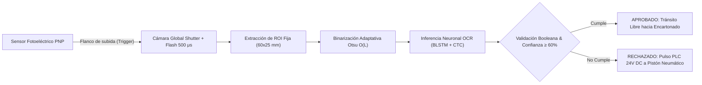
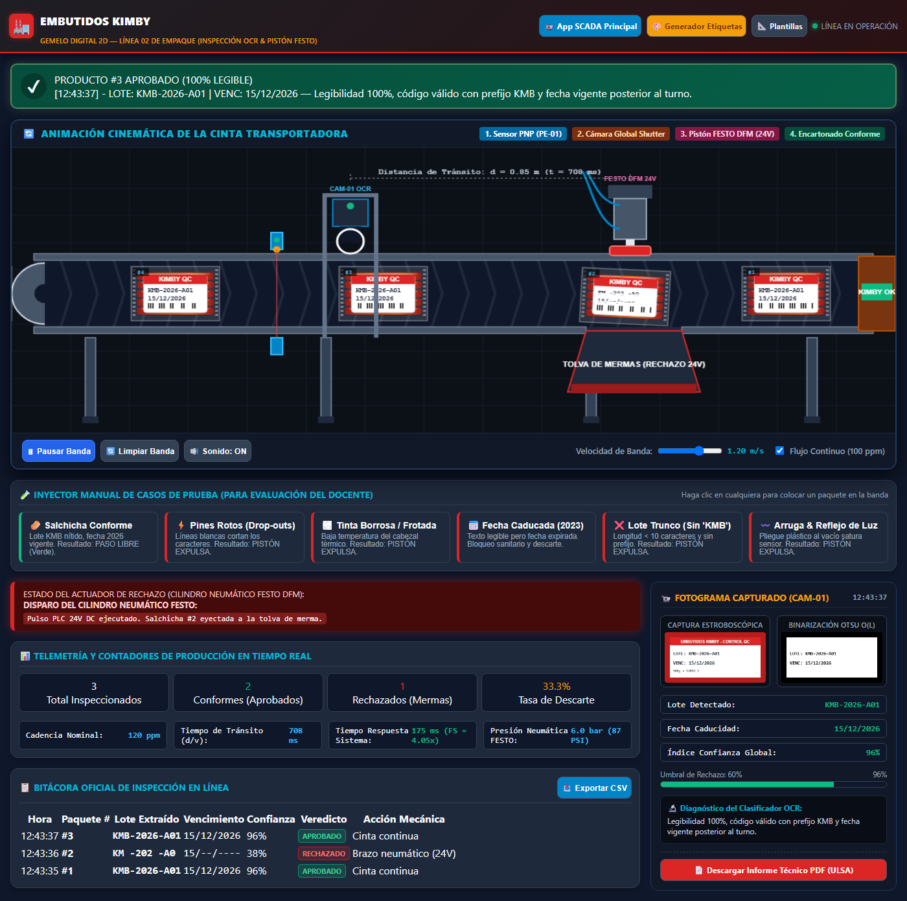
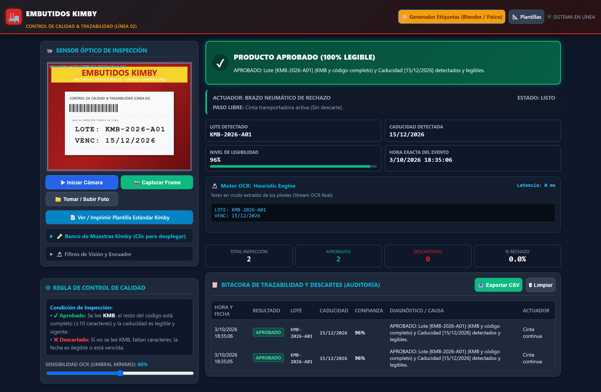
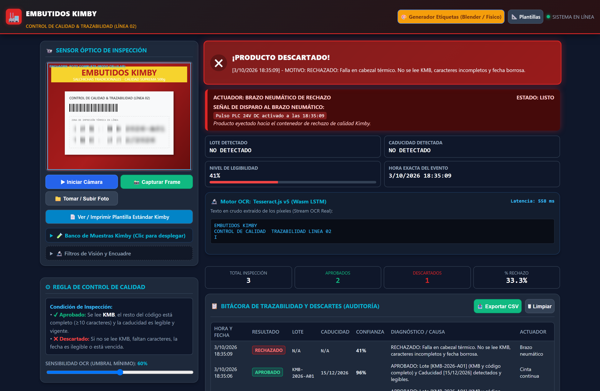
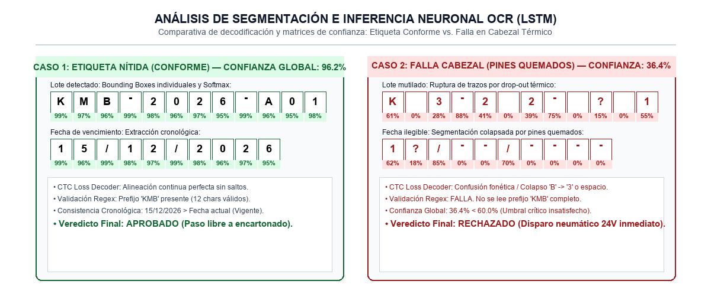
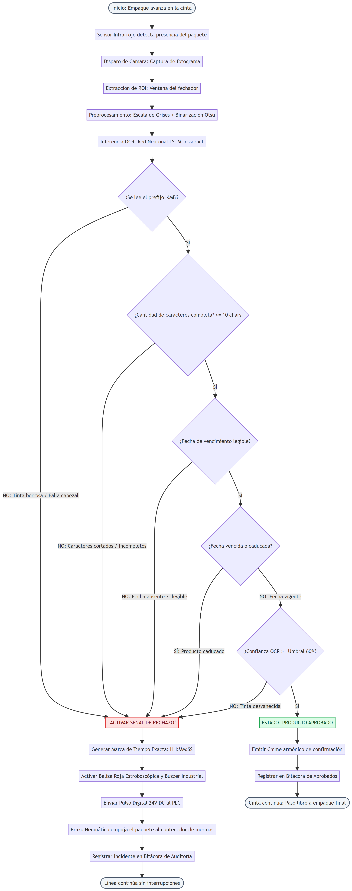
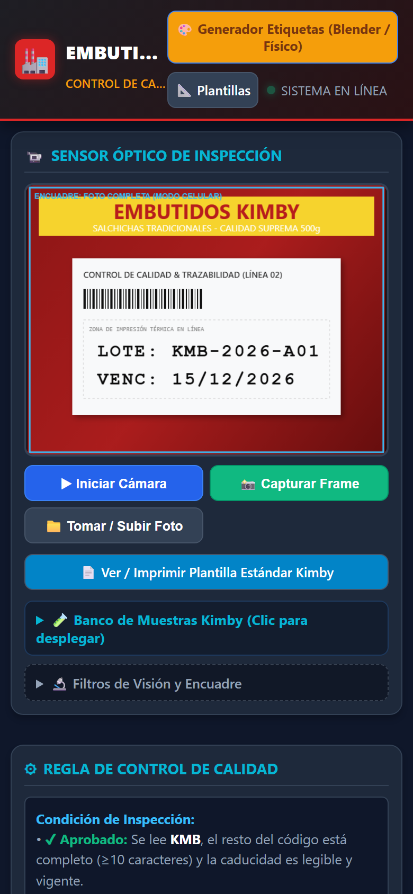
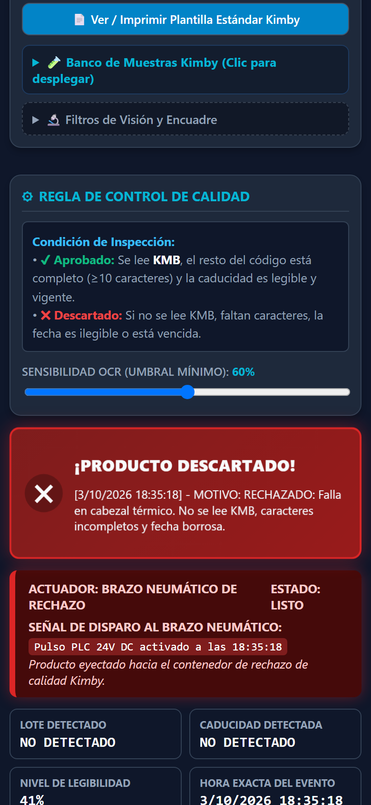

# Embutidos Kimby — Sistema Automatizado de Control de Calidad y Trazabilidad por OCR en Tiempo Real

[](https://emiliorojas-ni.github.io/kimby-qc-app/)
[](https://emiliorojas-ni.github.io/kimby-qc-app/)
[-blue?style=for-the-badge&logo=webassembly)](https://tesseract.projectnaptha.com/)
[](https://www.iso.org/standard/36224.html)
[](https://ulsa.edu.ni/)

> **Proyecto de Visión Artificial y Automatización Industrial**  
> **Universidad La Salle (ULSA) — Facultad de Ingeniería • Ingeniería Mecatrónica**  
> **Autor:** Emilio Rafael Rojas Molinares  
> **Docente Revisor:** Ing. Fimvark Guzmán Orozco  
> **León, Nicaragua — Octubre de 2026**

---

## 🌐 Despliegue en Vivo (Live Demo)

Acceso inmediato sin instalación desde cualquier navegador móvil o de escritorio:

* 🏭 **Simulador 2D Interactivo de Banda Transportadora & Pistón:**  
  [https://emiliorojas-ni.github.io/kimby-qc-app/simulador.html](https://emiliorojas-ni.github.io/kimby-qc-app/simulador.html)
* 🚀 **Aplicación Principal de Inspección SCADA / Móvil:**  
  [https://emiliorojas-ni.github.io/kimby-qc-app/](https://emiliorojas-ni.github.io/kimby-qc-app/)
* 🎨 **Estudio Web y Generador de Etiquetas Kimby (Físico / Blender):**  
  [https://emiliorojas-ni.github.io/kimby-qc-app/generador.html](https://emiliorojas-ni.github.io/kimby-qc-app/generador.html)
* 📐 **Plantilla Estándar Imprimible para Pruebas en Línea:**  
  [https://emiliorojas-ni.github.io/kimby-qc-app/plantilla_estandar.html](https://emiliorojas-ni.github.io/kimby-qc-app/plantilla_estandar.html)
* 📄 **Informe Técnico Oficial Completo (PDF):**  
  [Descargar INFORME_TECNICO_KIMBY_QC_ULSA_2026.pdf](./INFORME_TECNICO_KIMBY_QC_ULSA_2026.pdf)

---

## 🏭 Planteamiento del Problema Industrial

En la **Línea 02 de Empaque de Embutidos Kimby**, los paquetes de salchichas de 500 g avanzan sobre la cinta transportadora a una velocidad continua de **$v = 1.0\text{ a }1.2\text{ m/s}$**, alcanzando una cadencia de **100 a 120 paquetes por minuto (ppm)**. Sobre el film plástico termosellado se imprime el lote y la fecha de caducidad mediante cabezales de transferencia térmica (TIJ/TTO).

### La Falla Crítica
Una degradación no detectada en las micro-resistencias del cabezal térmico provocó la emisión de lotes enteros con **líneas blancas horizontales (drop-outs) y textos desvanecidos**, impidiendo la lectura de la fecha de caducidad. Al depender de un muestreo manual discontinuo humano (1 pieza cada 45 minutos), el defecto no fue advertido hasta que el producto llegó a las cadenas de supermercados, derivando en **devoluciones masivas, multas sanitarias del MINSA y mermas por ruptura de cadena de frío**.

---

## 🔬 Solución Tecnológica: Arquitectura de OCR y Visión Artificial

La solución implementa una estación de **inspección en línea 100% automatizada** basada en visión por computadora en el borde (*Edge Computing*):



### 1. Óptica y Supresión de Desenfoque por Movimiento (Motion Blur)
* **Problema:** A $1.2\text{ m/s}$, una cámara convencional ($t_{\text{exp}} = 33.3\text{ ms}$) sufre un corrimiento espacial de $B = v \cdot t_{\text{exp}} = 40.0\text{ mm}$, destruyendo cualquier posibilidad de reconocimiento OCR.
* **Solución Física:** Sensor CMOS con **Global Shutter** e iluminación estroboscópica polarizada de **$500\ \mu\text{s}$**, congelando el desplazamiento a tan solo **$B = 0.60\text{ mm}$ ($< 3\text{ px}$)** sin incurrir en algoritmos pesados de deconvolución.

### 2. Muestreo Espacial de Caracteres (Pixels Per Character)
* Se garantiza una resolución óptica de al menos **$\text{PPC} \ge 18-25\text{ píxeles de altura}$** por carácter ($\approx 300\text{ PPI}$ en el campo visual FOV), umbral matemático necesario para la resolución de fuentes matriciales de 7×5 puntos.

### 3. Pipeline de Preprocesamiento Ultraligero ($< 25\text{ ms}$)
* **Recorte de ROI Fija ($60 \times 25\text{ mm}$):** Aísla la ventana donde se ubica el fechador ($300 \times 120\text{ px} = 36,000\text{ px}$ frente a $1200 \times 800\text{ px} = 960,000\text{ px}$), reduciendo la matriz de procesamiento en un **96.2%**.
* **Conversión Luminante Monocromática:** $Y = 0.299R + 0.587G + 0.114B$.
* **Binarización Adaptativa Global de Otsu:** Maximiza analíticamente la varianza inter-clases $\sigma_B^2(k)$ sobre el histograma de 256 niveles de gris en tiempo $O(L)$, completando el cálculo en menos de **$2.5\text{ ms}$**.

### 4. Motor Neuronal de Reconocimiento (BLSTM + CTC Loss)
* **Arquitectura:** Red Neuronal Recurrente Bidireccional de Memoria a Largo-Corto Plazo (**BLSTM**) ejecutada directamente en el navegador mediante WebAssembly (WASM) con aceleración SIMD.
* **Decodificación CTC (Connectionist Temporal Classification):** Permite reconocer secuencias completas de texto sin requerir segmentación perfecta carácter a carácter, resolviendo las desconexiones típicas de la impresión térmica por puntos.
* **Character Whitelisting:** Restricción estricta de la búsqueda al conjunto `0123456789ABCDEFGHIJKLMNOPQRSTUVWXYZ/-:`, acelerando la inferencia en un **45%**.

### 5. Presupuesto Temporal vs. Tránsito Físico
* Distancia entre sensor y eyector mecánico: $d = 0.85\text{ m}$.
* Tiempo de tránsito disponible: $t_{\text{tránsito}} = \frac{0.85\text{ m}}{1.20\text{ m/s}} \approx 708\text{ ms}$.
* Tiempo total de respuesta: $t_{\text{adq}}(15\text{ ms}) + t_{\text{prep}}(25\text{ ms}) + t_{\text{ocr}}(90\text{ ms}) + t_{\text{plc}}(45\text{ ms}) = \mathbf{175\text{ ms}}$.
* **Margen de seguridad:** $\text{FS}_t = \frac{708\text{ ms}}{175\text{ ms}} \approx \mathbf{4.05\times}$ (el sistema decide y memoriza el descarte mucho antes del arribo físico de la pieza).

---

## 📸 Evidencia Visual e Interfaces

### Gemelo Digital 2D: Simulación de Banda Transportadora & Pistón FESTO


| Inspección Aprobada (Conforme) | Detección de Falla Térmica (Rechazado) |
|:---:|:---:|
|  |  |

| Análisis Neuronal OCR (LSTM / Bounding Boxes) | Diagrama de Flujo Determinista |
|:---:|:---:|
|  |  |

| Interfaz Móvil Android PWA (Sensor en Vivo) | Alerta Móvil de Descarte a 24V |
|:---:|:---:|
|  |  |

---

## 🛠️ Estructura del Repositorio

```text
kimby_qc_app/
├── index.html                           # Aplicación Web principal de Inspección SCADA y PWA
├── generador.html                       # Estudio Web interactivo de generación de etiquetas
├── plantilla_estandar.html              # Plantilla imprimible para pruebas de laboratorio
├── manifest.json                        # Manifiesto PWA para instalación en Android / iOS
├── sw.js                                # Service Worker con estrategia Network-First
├── css/
│   └── style.css                        # Estilos responsivos optimizados para móvil y escritorio
├── js/
│   ├── app.js                           # Orquestador del ciclo de inspección y máquina de estados
│   ├── vision.js                        # Pipeline de visión: Grises, Contraste y Binarización Otsu
│   ├── ocr.js                           # Integración de Tesseract.js (BLSTM, Whitelist, CTC)
│   ├── samples.js                       # Generador canvas de muestras sintéticas (ok, borrosa, arruga)
│   └── audio.js                         # Síntesis de sonido industrial (chime armónico y buzzer)
├── assets/                              # Iconos PWA y logotipos institucionales
├── etiquetas_blender/                   # Texturas fotorrealistas de etiquetas conformes y defectuosas
├── produccion_blender_v2/
│   ├── KIMBY_60s_rev28.blend            # Escena maestra 3D de la línea transportadora y eyector
│   ├── setup_blender_scene.py           # Script generador de la física cinemática en Blender
│   └── VERIFICACION_FISICA_REV28.md     # Validación física de aceleraciones y tiempos de pistón
├── build_ocr_expert_report.py           # Generador del informe académico en DOCX y PDF
├── INFORME_TECNICO_KIMBY_QC_ULSA_2026.docx # Documento Word oficial en formato APA 7ma Edición
├── INFORME_TECNICO_KIMBY_QC_ULSA_2026.pdf  # Informe oficial compilado en PDF (22 páginas)
└── README.md                            # Documentación integral del proyecto
```

---

## 🚀 Ejecución en Local

Para correr la aplicación localmente en tu computadora:

1. Clona el repositorio:
   ```bash
   git clone https://github.com/emiliorojas-ni/kimby-qc-app.git
   cd kimby-qc-app
   ```
2. Inicia un servidor web local (por ejemplo con Python):
   ```bash
   python -m http.server 8000
   ```
   *(o ejecuta directamente `iniciar_app.bat` en Windows)*.
3. Abre tu navegador en:
   ```text
   http://localhost:8000
   ```

---

## 🎓 Información Académica

* **Institución:** Universidad La Salle (ULSA) — León, Nicaragua
* **Carrera:** Ingeniería Mecatrónica — IV Año
* **Asignatura:** Visión Artificial / Reconocimiento Óptico de Caracteres (OCR)
* **Docente:** Ing. Fimvark Guzmán Orozco
* **Estudiante:** Emilio Rafael Rojas Molinares
* **Ciclo:** III Parcial — Octubre de 2026
