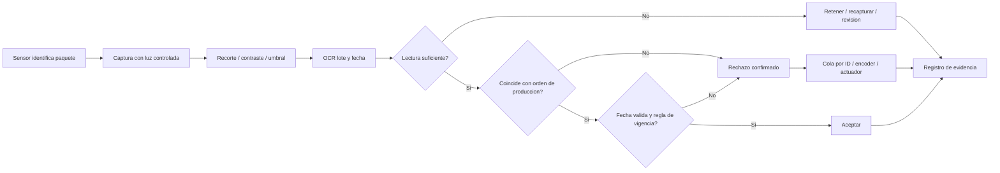

# Kimby — propuesta de montaje de 2:30

La guía original se conserva. Esta versión corrige las afirmaciones sin evidencia y propone integrar Blender con una demostración real de la web. La escena entregada es una primera secuencia de 12 segundos, no el video final de 150 segundos. No se ha generado video por IA.

## Dirección de montaje

Usar rojo Kimby para identidad, acero y azul oscuro para la planta, verde para aceptación, rojo para rechazo y ámbar para revisión. Cortar de etiqueta 3D a etiqueta física y luego al recorte real de la app; conservar fecha y lote de cada recurso sin regenerarlos con IA. Las dos texturas originales contienen textos regulatorios y de aprobación: son arte del proyecto y no acreditan una certificación real. En pantalla, identificar siempre el 3D como simulación y las muestras internas como muestras simuladas.

| Tiempo | Imagen y acción | Narración propuesta |
|---|---|---|
| 00–15 | Macro de etiqueta física borrosa, título y apertura tipo dron de Blender. | En Embutidos Kimby, una falla menor del cabezal térmico dejó una fecha de caducidad borrosa. El caso documenta una devolución costosa y una advertencia de control de calidad. El problema es detectar la impresión defectuosa antes de que el producto salga de la línea. |
| 15–33 | Cenital del codificador; acercamiento a la ventana de impresión. | La primera estación codifica el lote y la fecha sobre la etiqueta. Esto es impresión, diferente del sellado físico del envase. Después, una cámara captura esa zona mientras el paquete avanza. Una iluminación estable, poco reflejo y una exposición corta ayudan a conservar los bordes de los caracteres. |
| 33–50 | Recorrido hacia dentro de la estación; macro y esquema captura → recorte → contraste → OCR. | Aquí proponemos OCR: reconocimiento óptico de caracteres. OMR interpreta marcas e ICR se orienta al manuscrito. Para esta impresión alfanumérica, basta trabajar sobre una región pequeña, aplicar un preprocesamiento ligero y medir el tiempo total de captura y lectura. |
| 50–65 | Paquete aceptado, luego plano lateral cámara–actuador con cotas. | En nuestra simulación, la banda avanza a cero coma seis metros por segundo. La cámara y el actuador están separados noventa centímetros: el traslado toma uno coma cinco segundos. La decisión debe llegar a tiempo y acompañar al paquete correcto; este cálculo no demuestra el rendimiento de la app. |
| 65–110 | Grabación real: etiqueta impresa conforme; cámara de la web, captura y resultado real. Repetir con borrosa y fecha vencida. Mostrar texto extraído, confianza y CSV. | Ahora probamos el prototipo con etiquetas físicas. Observamos la imagen capturada, el texto que el motor realmente devuelve y la decisión de la aplicación. Repetimos con una impresión degradada y una fecha vencida. El resultado puede cambiar con el enfoque, la luz y el movimiento; por eso conservamos la evidencia de cada intento. Los botones de muestra y el indicador neumático representan simulaciones. Esta demostración no acredita conexión con un actuador físico ni operación industrial continua. |
| 110–135 | Macro borroso, RECHAZADO; pistón y bandeja. Inserto gráfico ámbar de revisión. | Para completar la solución industrial falta comparar lote y fecha contra la orden de producción. Una discrepancia confirmada se segrega. Si la lectura tiene baja confianza, se retiene para otra captura o revisión. Así evitamos convertir una duda del OCR en aceptación automática y reducimos el descarte innecesario de productos buenos. |
| 135–150 | Bitácora real y cierre general de Blender. | El siguiente paso es medir lecturas correctas, falsas aceptaciones, falsos rechazos y latencia, usando etiquetas claras, arrugadas y borrosas. Con esos datos se ajustan los umbrales. La propuesta mejora el control del proceso; sus beneficios deben verificarse antes de prometer ahorros o ausencia de devoluciones. |

Ritmo orientativo: ajustar las pausas con una lectura real; los intervalos son objetivos de edición, no duración de locución ya medida. Durante los 45 segundos de demo, dar espacio a la ejecución real sin acelerar la espera del OCR de manera engañosa.

## Flujo industrial propuesto

El flujo representa el diseño objetivo, no todas las funciones disponibles en la web. Con velocidad variable se requiere seguimiento por encoder o una estrategia equivalente; un temporizador fijo de 1,5 s solo corresponde al movimiento constante de esta animación. Considerar tiempo de actuación, distancia de seguridad y fallo de seguimiento en una implementación real.

## Restricciones y diagnóstico

- Eficiencia: detectar después de distribución provoca reproceso y devolución. En línea el presupuesto de latencia es acotado; un escaneo estático puede tolerar varias pasadas y algoritmos más costosos.
- Escalabilidad: inspección manual o captura aislada no prueba capacidad para todo el caudal. Medir tiempo de ciclo y rendimiento sostenido, no solo un intento exitoso.
- Calidad: la falla del cabezal necesita mantenimiento además de inspección. El OCR no garantiza legibilidad perfecta ni identifica por sí solo la causa mecánica.
- Preprocesamiento: recortar la ventana reduce píxeles; la binarización global es ligera pero puede fallar con reflejos. Comparar original y procesada antes de fijar parámetros.
- Tolerancias: validar umbrales con un conjunto etiquetado representativo. Confianza del OCR no equivale a probabilidad calibrada de estar correcto. Exigir concordancia exacta con orden de producción, controlar fechas imposibles y revisar casos inciertos.
- Hardware: reutilizar una cámara disponible para el ensayo. No hay cotización ni ensayo que sustente un costo menor de 50 dólares, latencia de milisegundos o capacidad a velocidad industrial.

## Evidencia del código existente

Revisión del 3 de octubre de 2026, sin modificar la app:

- `js/ocr.js`: `expectedLote` y `expectedVenc` existen, pero `evaluateRules` no los compara con la lectura; aplica presencia de KMB, estructura, presencia de fecha, confianza y fecha pasada.
- Prueba aislada de reglas, sin ejecutar OCR: con modo `strict`, un lote y una fecha distintos de los configurados devolvieron `APPROVED`. La entrada artificial, configuración y salida exactas están en `auditoria_reglas_app.json`; no son resultados de captura ni de reconocimiento.
- `js/ocr.js`: la ruta de muestras puede asignar textos y confianzas prefijados y forzar rechazo por el tipo de muestra. No usar esas cifras como resultados de OCR real.
- `js/app.js`: carga una muestra automática al iniciar; el estado inicial no prueba una captura física. Indicador neumático visual, sin evidencia de salida eléctrica de 24 V.
- `index.html`: Tesseract se carga desde CDN. No afirmar funcionamiento completamente offline sin ensayo de recursos, caché y modelos.
- `js/vision.js`: histograma y umbral por varianza entre clases; medir el costo sobre la región de interés y bajo la iluminación del ensayo.
- Fuente del caso: devolución costosa y advertencia de calidad. No documenta sanciones sanitarias, millones perdidos ni porcentajes de mejora.

## Grabación pendiente

Imprimir las etiquetas del proyecto, sostenerlas sobre un paquete real, bloquear enfoque/exposición si el dispositivo lo permite y grabar teléfono + pantalla. Ejecutar captura real, conservar intentos fallidos y evitar los botones sintéticos en la toma presentada como OCR. La fecha de producción impresa en las etiquetas es posterior al día de esta elaboración; tratarlas como material de ensayo, sin atribuir producción real. Capturar la comparación contra orden solo cuando se implemente; entretanto explicarla mediante el diagrama. Confirmar con el docente si la web/PWA satisface el requisito de aplicación disponible en tiendas mencionado en la consigna.

Para posteriores clips generativos: reservarlos para transiciones y ambiente. Conservar macros de etiquetas, cifras y pantallas de la web como material real o render determinista de Blender.
